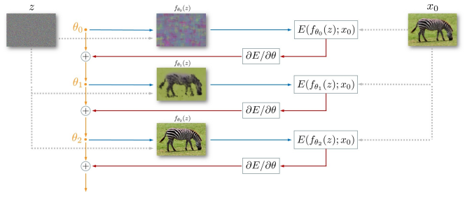
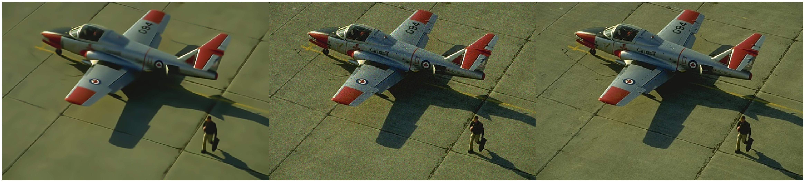
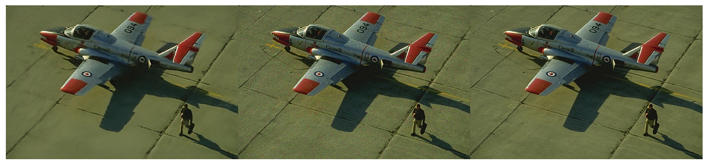
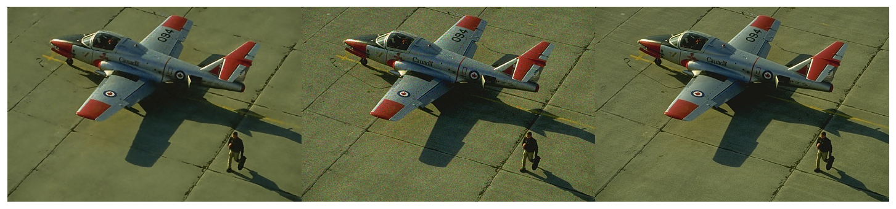
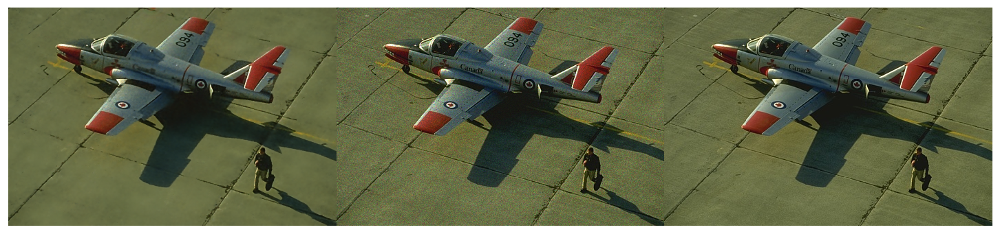
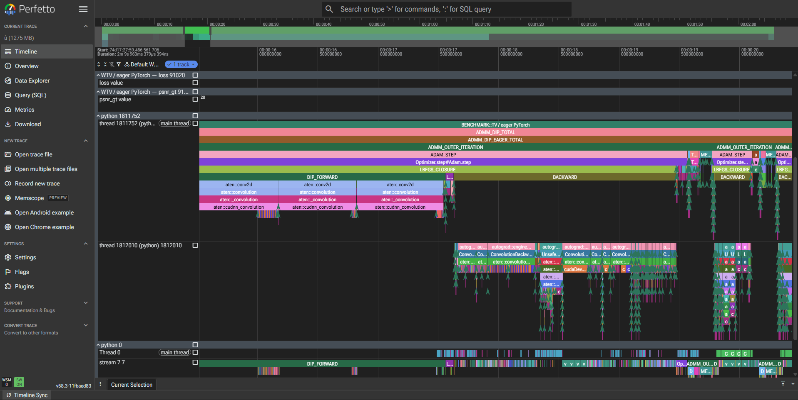
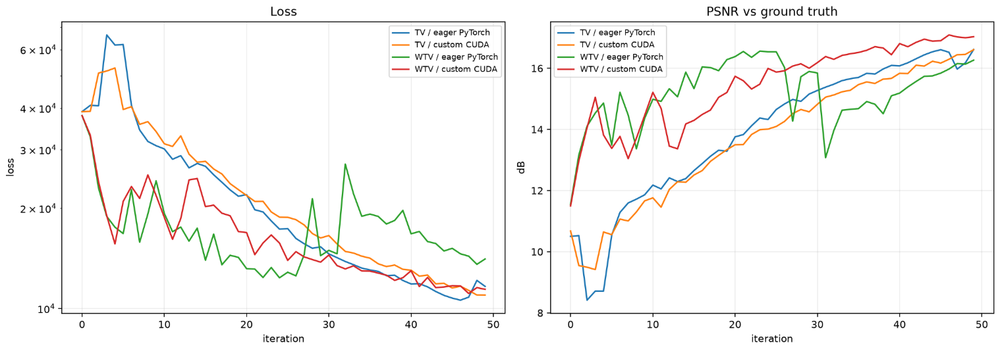

# GPU-Accelerated Deep Image Prior for Image Denoising

## Introduction

This project was adapted from Stanford University's **EE367 / CS448I:
Computational Imaging** course. The course explores how computation and imaging
systems can be designed together to recover useful visual information from
indirect, incomplete, or noisy measurements. This repository applies those
ideas to image denoising and serves as a foundation for compressed-sensing
reconstruction of chest CT images.


The project uses **Deep Image Prior (DIP)**, an inverse-problem optimization
technique that represents the unknown image with an untrained convolutional
neural network. Instead of learning from a large dataset, DIP optimizes the
network for a single corrupted observation; the network architecture itself
acts as an implicit prior that tends to reproduce natural image structure
before fitting noise.



This repository explores single-image restoration with **Deep Image Prior
(DIP)**, **ADMM**, and total-variation regularization. The main engineering
achievement is a native PyTorch C++/CUDA extension for the image operators used
inside ADMM. On a real `1 × 3 × 320 × 480` DIP output, the custom periodic
gradient is numerically consistent with the FFT implementation and is **9.52×
faster** in the recorded CUDA-event benchmark.

> **Current scope.** The working experiments use RGB images from the local
> BSDS300 sample for denoising. The repository title describes the longer-term
> chest-CT/compressed-sensing direction; a CT measurement operator and CT
> dataset are not yet part of the validated pipeline.

## Denoising results on BSDS300

The following composites compare the reconstructed image (**left**), noisy
input (**center**), and ground truth (**right**). All four methods were evaluated
on the same BSDS300 denoising example.

### BM3D



- PSNR: **31.721 dB** (noisy input: 27.485 dB)
- SSIM: **0.8032** (noisy input: 0.5448)
- DSSIM: **0.2778**

### Deep Image Prior (DIP)



- Network parameters: **2,212,671**
- Optimizer: **Adam**
- Reported at iteration 723: **29.86 dB PSNR**, **0.7607 SSIM**, and
  **0.2178 DSSIM** (PSNR to noisy input: 26.62 dB)
- Early stopping restored the best checkpoint from iteration **703**.

### ADMM-DIP



- Network parameters: **2,212,671**
- Optimizer: **Adam**, learning rate **0.01**
- Best restored checkpoint: **33.049 dB PSNR** at iteration **1865**
- At the early-stopping iteration (1965): 31.642 dB PSNR to ground truth and
  27.513 dB PSNR to the noisy input

### CUDA-accelerated ADMM-DIP



- Network parameters: **2,212,671**
- At iteration 1999: **32.610 dB PSNR** to ground truth and **27.913 dB PSNR**
  to the noisy input
- Uses the native CUDA image operators, compiled on first use.

The strongest reported reconstruction PSNR is **33.049 dB** from the restored
ADMM-DIP checkpoint, an improvement of approximately **5.56 dB** over the noisy
input.

## Highlights

- Vanilla DIP denoising with an untrained convolutional generator.
- ADMM-DIP with total variation (TV) and adaptive weighted TV (WTV).
- Native CUDA kernels for periodic gradient, divergence, shrinkage, and dual
  updates, with a transparent PyTorch fallback.
- Autograd support for the custom periodic-gradient operator.
- Reproducible comparison of eager PyTorch, compiled PyTorch, and custom CUDA
  implementations on the same image and noisy observation.
- PyTorch Profiler/Perfetto traces plus loss and ground-truth PSNR tracks.
- Classical BM3D, Wiener, TV, Richardson–Lucy, and supervised-model baselines.

## Motivation from the Deep Image Prior paper

This work builds on Ulyanov, Vedaldi, and Lempitsky's
[*Deep Image Prior*](paper.pdf). Their central observation is that useful image
statistics do not have to be learned from a large training dataset: the
structure of a convolutional generator itself biases optimization toward
natural images. The network is therefore not a pretrained denoiser. Its weights
start randomly and are optimized for one corrupted image only.

This architectural bias is particularly useful when training pairs are scarce
or unavailable. Convolutions, downsampling, upsampling, nonlinearities, and
skip connections favor spatially coherent, multiscale structure. During
optimization, a DIP network tends to reconstruct the dominant image structure
before it fits unstructured noise. The paper describes this behavior as a high
impedance to noise and a lower impedance to natural signal.

The behavior is not permanent: a sufficiently expressive network can
eventually reproduce the corruption as well. Denoising therefore depends on
the optimization trajectory, not only its final minimum. Early stopping selects
a reconstruction before the network begins to overfit the noisy observation.
This is why the implementations in this repository track reconstruction
metrics and retain a best checkpoint instead of assuming that the last
iteration is the best image.

## Method

For a general inverse problem, let \(y\) be a degraded observation of an unknown
image \(x\), and let \(A\) describe the image-formation process:

$$
y=Ax+\eta,
$$

where \(\eta\) is measurement noise. A conventional reconstruction minimizes a
task-dependent data term together with an explicit image regularizer:

$$
x^*=\arg\min_x E(x;y)+R(x).
$$

DIP replaces direct pixel optimization with an untrained network
parameterization \(x=f_\theta(z)\), where \(z\) is a fixed random tensor. The
network weights—not a dataset—are optimized for the current observation:

$$
\theta^*=\arg\min_\theta E\!\left(Af_\theta(z);y\right),
\qquad
\hat{x}=f_{\theta^*}(z).
$$

For denoising, \(A=I\) and the basic DIP objective becomes

$$
\min_\theta \frac{1}{2}\lVert f_\theta(z)-y\rVert_2^2.
$$

The original paper primarily relies on the network architecture as an implicit
prior. This repository investigates an additional explicit TV prior, producing
the combined objective

$$
\min_\theta \frac{1}{2}\lVert f_\theta(z)-y\rVert_2^2
+ \lambda\lVert Df_\theta(z)\rVert_{2,1},
$$

where \(D\) is the horizontal/vertical finite-difference operator. The implicit
DIP prior encourages multiscale natural-image structure, while TV explicitly
penalizes excessive local variation and promotes piecewise-smooth regions.
The weighted-TV variant adapts the regularization strength spatially to better
preserve important edges.

### ADMM splitting

Introducing a split variable \(v=Df_\theta(z)\) separates the nonsmooth TV term
from network fitting:

$$
\min_{\theta,v}
\frac{1}{2}\lVert f_\theta(z)-y\rVert_2^2+\lambda\lVert v\rVert_{2,1}
\quad\text{subject to}\quad v=Df_\theta(z).
$$

ADMM alternates between updating the DIP network, applying TV shrinkage, and
updating the dual variables. This makes the method modular, but repeatedly
evaluating the spatial derivatives creates a performance-critical inner path.
The CUDA extension targets that path.

### Native CUDA acceleration

The CUDA extension computes the periodic forward differences directly in image
space:

$$
D_hx[i,j]=x[i,j+1]-x[i,j], \qquad
D_vx[i,j]=x[i+1,j]-x[i,j],
$$

with wrap-around boundaries. This avoids the forward FFT, two frequency-domain
multiplications, and two inverse FFTs previously needed for each gradient call.
The extension also implements the adjoint divergence used during backpropagation
and a fused shrinkage/dual-update kernel. PyTorch's autograd interface connects
these native operations to optimization of the DIP network.

In short, the paper supplies the **implicit network prior**; this repository
adds **explicit TV/WTV regularization, ADMM optimization, native CUDA image
operators, and end-to-end profiling** around that foundation.

## Recorded achievement: custom CUDA gradient

The optimization and profiling experiments were performed on an **NVIDIA A100
GPU**. The following measurements were obtained over 100 calls on one real DIP
output of shape `1 × 3 × 320 × 480`, using `float32` on `cuda:0`.

| Implementation | Total time (100 calls) | Average per call | Relative speed |
|---|---:|---:|---:|
| FFT gradient | 39.189503 ms | 391.895 µs | 1.00× |
| Custom CUDA gradient | 4.116480 ms | 41.165 µs | **9.52×** |

Correctness against the FFT reference:

| Direction | Maximum absolute error | Mean absolute error |
|---|---:|---:|
| Horizontal | `3.2619573e-07` | `6.2645512e-08` |
| Vertical | `2.5774352e-07` | `4.7060624e-08` |

The profiler also reduced total self-CUDA time for 100 profiled calls from
`70.728 ms` to `8.105 ms`. Small floating-point differences are expected
because the implementations use different numerical paths.

## Denoising results

Representative metrics already recorded in [`system.ipynb`](system.ipynb) for
one BSDS image with speckle noise are shown below. These are individual notebook
runs, not dataset-wide averages.

| Method | Best/final PSNR against ground truth | SSIM against ground truth | Notes |
|---|---:|---:|---|
| Noisy observation | 24.08 dB | 0.6122 | Input baseline from the BM3D run |
| BM3D | 25.35 dB | 0.6752 | Classical baseline |
| DIP | 23.34 dB | 0.6063 | Early-stopped; best checkpoint at iteration 867 |
| ADMM-DIP-TV | 23.36 dB | — | Best checkpoint at iteration 893 |

### Add new notebook results here

Run all cells in [`system.ipynb`](system.ipynb), then add the final values to
the table below. Keep the image index, noise model, noise level, seed, and
iteration count beside every result so comparisons remain reproducible.

<!-- RESULTS:END -->


The end-to-end profiler can also generate a comparison plot at
`profiling/dip_native_cuda_test_metrics.png`:



## Repository layout

```text
.
├── Dataset/                       Local image data
├── src/
│   ├── admm_cuda.py               Lazy CUDA loading and PyTorch fallback
│   ├── cuda_ops/
│   │   ├── admm_ops.cpp           PyTorch extension bindings
│   │   └── admm_ops_cuda.cu       Native CUDA kernels
│   ├── denoise_dip_tv_eager.py    ADMM-DIP-TV, eager implementation
│   ├── denoise_dip_tv_compile.py  Compiled implementation
│   ├── denoise_dip_tv_cuda.py     Native-CUDA TV implementation
│   ├── denoise_dip_tvw_eager.py   Weighted-TV eager implementation
│   └── denoise_dip_tvw_cuda.py    Weighted-TV CUDA implementation
├── results/                       Restored-image outputs
├── profiling/                     Perfetto traces and metric plots
├── profile_dip_eager_cuda_perfetto.py
├── run_dip_denoise_deblur.py      Experiment runner and dataset loader
├── paper.pdf                       Deep Image Prior reference paper
└── system.ipynb                   Main experiment notebook and results
```

## Setup

Create and activate a Python environment, then install the Python dependencies:

```bash
python -m venv .venv
source .venv/bin/activate
python -m pip install --upgrade pip
python -m pip install -r requirements.txt
```

The classical and CPU/PyTorch paths do not require the native extension. To use
the custom kernels, an NVIDIA GPU, a CUDA-enabled PyTorch build, the CUDA
toolkit, and `nvcc` are required. The extension is compiled lazily on its first
CUDA call and cached under `src/cuda_ops/build/`.

For the CUDA 13 packages used during the recorded experiment, expose the
toolkit headers and libraries as follows. Adjust `python3.11` and `cu13` to
match the active environment:

```bash
export CUDA_PYTHON_ROOT="$CONDA_PREFIX/lib/python3.11/site-packages/nvidia/cu13"
export CPATH="$CUDA_PYTHON_ROOT/include${CPATH:+:$CPATH}"
export LIBRARY_PATH="$CONDA_PREFIX/lib:$CUDA_PYTHON_ROOT/lib${LIBRARY_PATH:+:$LIBRARY_PATH}"
export LD_LIBRARY_PATH="$CONDA_PREFIX/lib:$CUDA_PYTHON_ROOT/lib${LD_LIBRARY_PATH:+:$LD_LIBRARY_PATH}"
```

## Run the CUDA correctness and speed benchmark

From the repository root:

```bash
python -m src.verifying_cuda
```

The test:

1. creates one real DIP output;
2. compares custom CUDA horizontal and vertical gradients with the FFT result;
3. profiles both implementations;
4. reports CUDA-event timing and speedup; and
5. runs an autograd gradient check.

To force the portable PyTorch fallback in other experiments, set
`DIP_DISABLE_CUDA_EXT=1`.

## Profile the complete ADMM-DIP pipeline

This command runs TV/WTV eager and CUDA variants on the same deterministic
input, exports a Perfetto trace, and saves a metric plot:

```bash
TORCH_COMPILE_DEBUG=1 python profile_dip_eager_cuda_perfetto.py \
  --iterations 10 \
  --image-index 0 \
  --require-native-cuda \
  --output profiling/dip_native_cuda_test.json \
  --plot profiling/dip_native_cuda_test_metrics.png
```

Open the generated JSON at [Perfetto UI](https://ui.perfetto.dev/) to inspect
CPU/CUDA kernels, ADMM iteration regions, memory behavior, loss, and PSNR.

To inspect code produced by `torch.compile`/Inductor, prefix the relevant Python
command with:

```bash
TORCH_LOGS="output_code,kernel_code" python your_script.py
```

## Run experiments

For an interactive walkthrough and the saved outputs, start Jupyter and open
[`system.ipynb`](system.ipynb):

```bash
jupyter notebook system.ipynb
```

Experiment parameters—including noise level, iteration count, optimizer, ADMM
penalty, and early stopping—are defined in [`src/config.py`](src/config.py).
Generated images are written under `results/`; profiling artifacts are written
under `profiling/`.

## Evaluation

The project tracks:

- **PSNR** — reconstruction fidelity in decibels; higher is better.
- **SSIM** — structural similarity; higher is better.
- **DSSIM/edge score** — gradient-structure discrepancy; lower is better when
  interpreted as dissimilarity.
- **Runtime and CUDA time** — operator and end-to-end performance.

For a fair method comparison, reuse the exact same clean image, noisy
observation, noise seed, and preprocessing for every method.

## Reference

D. Ulyanov, A. Vedaldi, and V. Lempitsky, “Deep Image Prior,” *International
Journal of Computer Vision*, 2020. The local paper is available as
[`paper.pdf`](paper.pdf); the original preprint identifier is arXiv:1711.10925.

## License

See [`LICENSE`](LICENSE).
